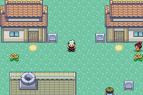
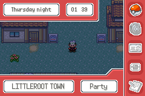
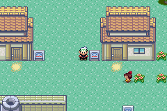
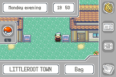
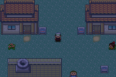
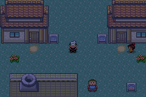
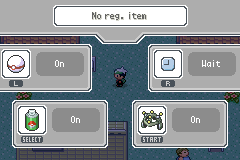

# Feature branch for custom Start and Select menu UIs



First of all, the ground work for all this was laid out by [Voluptua](https://github.com/volromhacking/pokeemerald/tree/start_menu_1). Then  [Phantonomy](https://github.com/Ddaretrogamer/Sun-and-Moon-Eclipse/tree/vol_start_menu_pal_switcher) ported it to a more recent version of pokeemerald-expansion and added the palette switching via in-game options.

I refactored the start menu, added a couple of features and the ability to customize which options show up and their order, and then made my custom select menu based on what I learned by editing their amazing work.

## The start menu
in `include/config/heat_menus.h` you can change a bunch of configs. starting from `ENABLE_HEAT_START_MENU`, without which the game would automatically use the regular old start menu. 

If you want to use the in-game options menu to change the palette of the menus, you must enable `HEAT_MENUS_SAVEBLOCK_PALETTES`. Without this, the game will only load the default grey palette. With it enabled, it will take up some space in saveblock 2 to store the index of the selected palette.



with `HSM_CONFIG_L_SHORTCUT`, you can assign any of the menu options to a shortcut that's shown to the player to use that option directly by pressing the L button while in the start menu. I find it useful as a reminder that the player can open the pokenav with the L button from the overworld in my hack, although that feature is not included in this feature branch.



You can also bind the R button to the debug menu while in the start menu, by setting `HSM_CONFIG_R_DEBUG` to true. 

Finally, you can customize which options you want to show up in the menu by disabling `HSM_CONFIG_SHOW_POKEDEX` and other defines, or just reorder the options in the enum in `heat_start_menu.c` (nothing is hard-coded so changing the order of the enum will be reflected in the UI just fine). The code should also be readable enough that you can extend, add or customize menu options without much difficulty.



## The select menu

This is enabled by setting `ENABLE_HEAT_SELECT_MENU` to `TRUE` in `config/heat_menus.h` and is a bit trickier to use. Since I made it with a bunch of other features baked into it on my hack, it comes with a barebones implementation that requires you to define the states of the buttons and add the sprites you want for your functionalities.



It features a display of the registered item you want to use, and a bunch of shortcuts for the L, R, select and start buttons.
You can enable multiple registered items from `config/save.h` by setting `ENABLE_MULTIPLE_REGISTERED_ITEMS` to `TRUE`. In that case, from the select menu you'll be able to scroll through all the registered items and select which one you want to use.



A feature I kept baked into this menu is the time picker. It only works if you enable `OW_USE_FAKE_RTC` from `config/overworld.h`, and allows the player to quickly jump to a different time of day. In that case, please avoid setting the wall clock in your hack as that makes all kinds of messes with the overworld's day / night system and the fake rtc time telling. I haven't yet figured it out, but just avoiding the wall clock altogether works fine in my project.



This time picker state of the menu can also be easily changed into whatever you want as a secondary menu state, feel free to edit the functions in `heat_select_menu.c` to handle the state of the 4 shorcut buttons differently, rename time picker mode to anything else and change up the sprites and text windows accordingly. The code in `heat_select_menu.c` should be written a bit better since I wrote it kinda from scratch after everything I learned from the start menu, so it should be fairly easy to decode what everything does and edit parts of it.

## I don't want that select menu at all!
You can pull this branch and leave `ENABLE_HEAT_SELECT_MENU` to `FALSE`, or you can just cherry-pick the first commit of it which only contains the start menu.

In the future I'll try to make another branch with these menus and also all the features I use in my hack from the select menu baked in (exp-all toggle on/off, infinite repel toggle on-off, pokevial with dose counter). I figured not everyone will want something this specific so a separate branch could work.

# About `pokeemerald-expansion`

  
# Outfits System

## What is this?

This is a feature branch that implements _Outfits System_ into Pokémon Emerald, which also adds:
*  SDH's [commit](<https://github.com/ShinyDragonHunter/pokeemerald/commit/05f8f2688b22454e9d2400db1621375f1e4ccb3c>) for simplifying the player states system and thus making this system easier to implement. (Required)
* An item called _`OUTFIT BOX`_ for storing and changing the player's current outfit.
* A menu for changing outfits that is called in the OUTFIT BOX item. (Can also be configured to be called somewhere else if wanted)
* Several scripting macros for unlocking an outfit, checking the state of an outfit and buffers an outfit's name/description.

This is _not_ a faithful port of Gen 6's Outfits System. So, if you want it to behave similarly to Gen 6's system, you're likely gonna have to go on your own there. However, questions regarding the Outfits System is welcomed.

Note that this feature branch is still missing some of the features that's necessary, such as the ability to purchase outfits. So, stay tune for more until then!

**`pokeemerald-expansion`** offers hundreds of features from various [core series Pokémon games](https://bulbapedia.bulbagarden.net/wiki/Core_series), along with popular quality-of-life enhancements designed to streamline development and improve the player experience. A full list of those features can be found in [`FEATURES.md`](FEATURES.md).

<!-- TODO: Too busy to fix, so I'll put it here -->
### - Trainer Card shows Player's trainer pic for Link (Cable) Players

## Credits

If you use **`pokeemerald-expansion`**, please credit **RHH (Rom Hacking Hideout)**. Optionally, include the version number for clarity.

```
Based off RHH's pokeemerald-expansion 1.13.3 https://github.com/rh-hideout/pokeemerald-expansion/
```

Please consider [crediting all contributors](CREDITS.md) involved in the project!

# Choosing `pokeemerald` or **`pokeemerald-expansion`**

- **`pokeemerald-expansion`** supports multiplayer functionality with other games built on **`pokeemerald-expansion`**. It is not compatible with official Pokémon games.
- If compatibility with official games is important, use [`pokeemerald`](https://github.com/pret/pokeemerald). Otherwise, we recommend using **`pokeemerald-expansion`**.
- **`pokeemerald-expansion`** incorporates regular updates from `pokeemerald`, including bug fixes and documentation improvements.

# [Getting Started](INSTALL.md)

❗❗ **Important**: Do not use GitHub's "Download Zip" option as it will not include commit history. This is necessary if you want to update or merge other feature branches. 

If you're new to git and GitHub, [Team Aqua's Asset Repo](https://github.com/Pawkkie/Team-Aquas-Asset-Repo/) has a [guide to forking and cloning the repository](https://github.com/Pawkkie/Team-Aquas-Asset-Repo/wiki/The-Basics-of-GitHub). Then you can follow one of the following guides:

## 📥 [Installing **`pokeemerald-expansion`**](INSTALL.md)
## 🏗️ [Building **`pokeemerald-expansion`**](INSTALL.md#Building-pokeemerald-expansion)
## 🚚 [Migrating from **`pokeemerald`**](INSTALL.md#Migrating-from-pokeemerald)
## 🚀 [Updating **`pokeemerald-expansion`**](INSTALL.md#Updating-pokeemerald-expansion)

# [Documentation](https://rh-hideout.github.io/pokeemerald-expansion/)

For detailed documentation, visit the [pokeemerald-expansion documentation page](https://rh-hideout.github.io/pokeemerald-expansion/).

# [Contributions](CONTRIBUTING.md)
If you are looking to [report a bug](CONTRIBUTING.md#Bug-Report), [open a pull request](CONTRIBUTING.md#Pull-Requests), or [request a feature](CONTRIBUTING.md#Feature-Request), our [`CONTRIBUTING.md`](CONTRIBUTING.md) has guides for each.

# [Community](https://discord.gg/6CzjAG6GZk)

[](https://discord.gg/6CzjAG6GZk)

Our community uses the [ROM Hacking Hideout (RHH) Discord server](https://discord.gg/6CzjAG6GZk) to communicate and organize. Most of our discussions take place there, and we welcome anybody to join us!
- Slawter666, for their original costumes system that inspires me for doing this. 
- SDH for his commit that simplify the player states system and thus helps makes the process of creating this much easier.
- RavePossum for helping me with my silly mistakes that causes bugs and bringing ideas.
